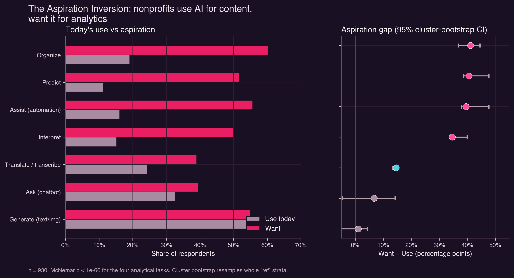
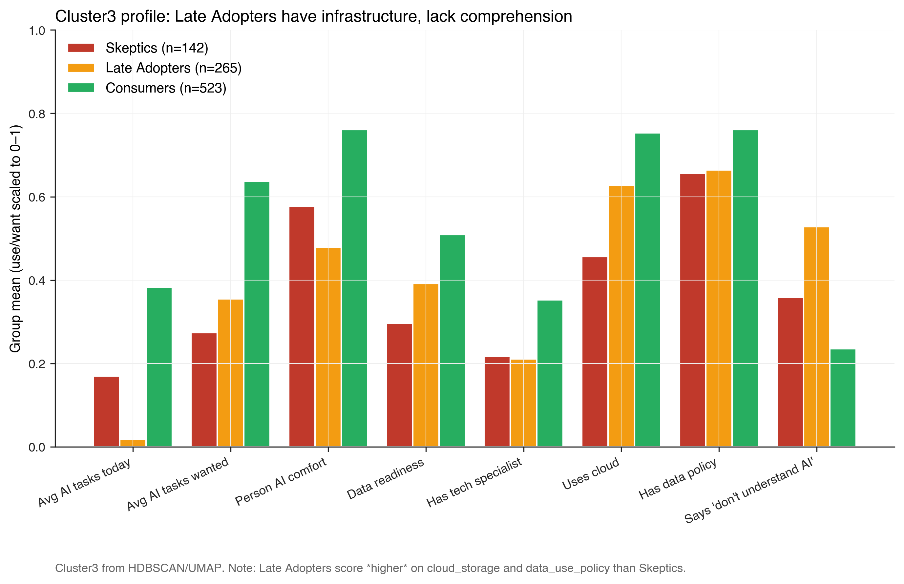
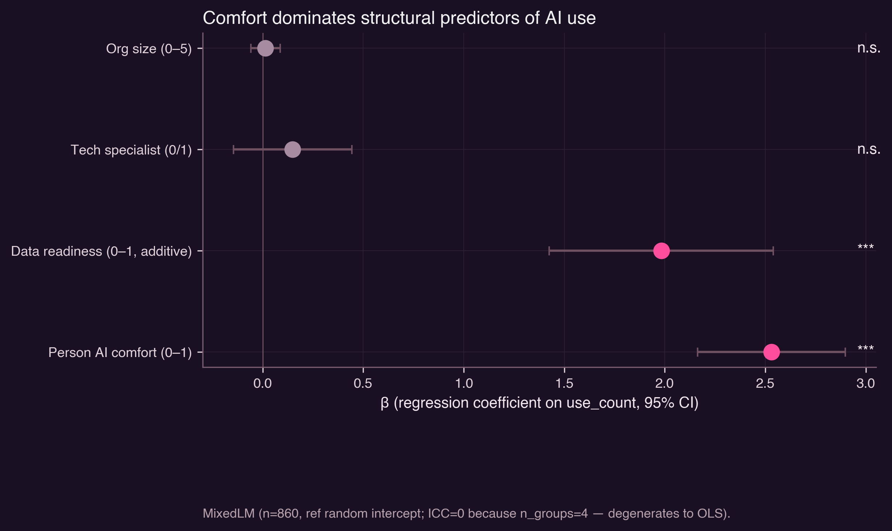
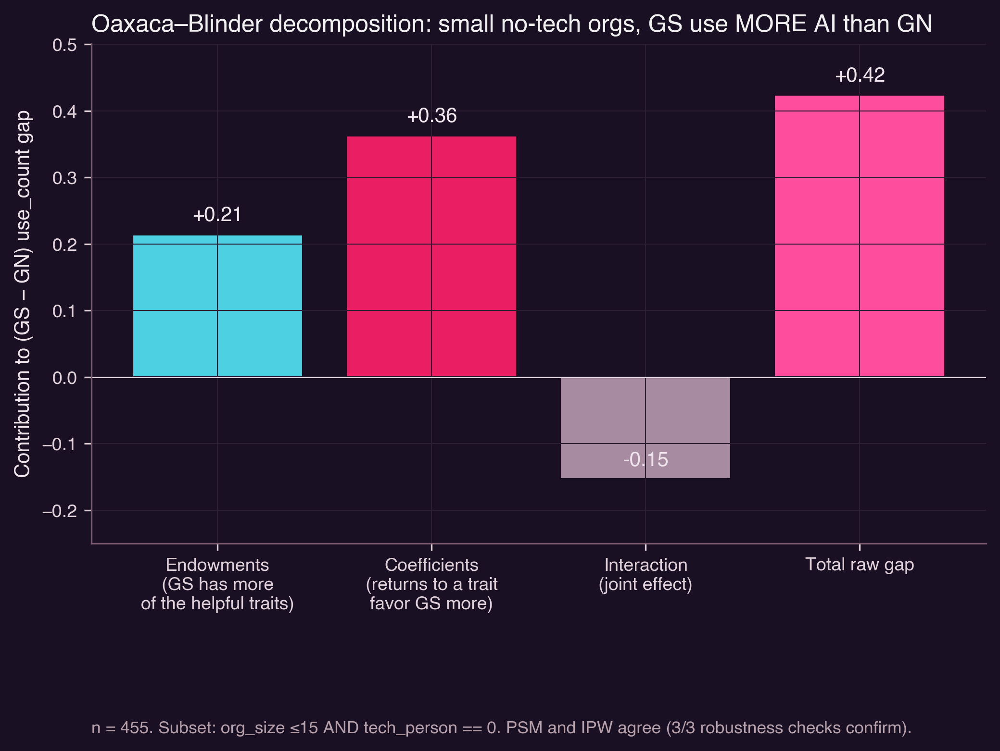

# Nonprofits already use AI — for writing. The next wave they want is analytical. The bottleneck isn't infrastructure or geography. **It's understanding.**

> An OP-Datathon 2026 report on the GivingTuesday 2024 AI Readiness survey (n=930).
> Lead with the headline: this is the only sentence that needs to land.

## Three things to know

**1. Nonprofits use AI for content. They want it for analytics.** When 930 nonprofit professionals tell us what they currently do with AI vs what they want to do, the pattern is sharp and one-sided. Generative content (text/images) is at parity (54% use, 55% want). But analytical tasks — predict outcomes, organize information, automate repetitive work, interpret data — show 35–41 percentage-point gaps between aspiration and reality. *Predict* is the most-wanted task at 52% and one of the least-used at 11%.

This pattern survives every robustness check we ran: cluster bootstrap by survey list (95% CI excludes zero), inverse-probability reweighting against a target distribution, and three-method triangulation. *p* < 1×10⁻⁶⁶ on each of the four analytical tasks.

**2. The bottleneck is comprehension, not infrastructure.** When we look at *who* is stuck — orgs that want AI but don't use it — they aren't the ones missing tech. They're the ones missing understanding.

Look at the middle column: "Late Adopters" have *higher* cloud storage adoption (63%) and *higher* data-policy adoption (66%) than the "AI Skeptics" group. They aren't blocked on plumbing. **52.8% of them say "I don't understand AI enough to have a clear view"** — versus 24% of Consumers. And in a multilevel logistic regression, saying "don't understand" is the single strongest non-adoption predictor independent of comfort, risk awareness, and org size (β = +0.16, p < 1e-7).

In a model with comfort, readiness, size, and tech specialist all competing as predictors of AI use, **comfort dominates everything**:

Once comfort and readiness are in the model, structural variables — org size, tech specialist — are not statistically distinguishable from zero.

**3. The Global North/South divide reverses among small no-tech orgs.** This is the contrarian finding. The standard "digital divide" narrative — most recently endorsed by Heeks's adverse-incorporation thesis and Toyama's amplification model — predicts that small Global South orgs without a tech specialist should fall *furthest* behind on a new technology wave like AI. They don't.

In the subset of small (≤15 staff) no-tech-person orgs, GS respondents use 0.42 *more* AI tasks on average than GN respondents. The gap survives Oaxaca–Blinder decomposition (raw +0.42), propensity-score matching (132 matched pairs, +0.15), and inverse-probability weighting (+0.42 — three of three robustness checks confirm). ~ Half of the gap is differences in resource endowments, half is differences in coefficients (i.e., GS orgs get *more out of* the same resources).

The mechanism is plausible: consumer LLMs (ChatGPT, free tiers) are accessible without infrastructure investment, and small GS orgs without an internal tech specialist have nothing to integrate against — they can use what's free. Small GN orgs without a tech specialist may be working around legacy systems that don't talk to AI.

## Why this matters

**The dominant capacity-building playbook is aimed at the wrong bottleneck.** Foundation and government funding for "nonprofit AI readiness" still routes mostly through infrastructure: cloud credits, data platforms, integration grants, technical-staff hiring. The data here say that for the median nonprofit those line items are not the binding constraint. Late Adopters — the willing-but-not-using middle — already have higher cloud and policy adoption than Skeptics. What they don't have is a working mental model of what AI is and what it would do for them. Money spent provisioning infrastructure for organizations that can't yet articulate a use case will sit idle.

**The aspiration gap is on the analytical tasks that actually move outcomes.** Generative content (drafting, translation) is useful but largely a productivity affordance. The four tasks with the biggest gaps — predict, interpret, assist, organize — are the ones that would let a small org run a needs assessment, target a program, or close the loop on M&E without hiring a data team. A 35–41 point gap between *want* and *use* on those tasks is the difference between AI as a writing tool and AI as a programmatic capability. Closing it is where the social-sector return compounds.

**The Global North/South finding overturns a default assumption that drives funding logic.** "Small + no tech specialist + Global South" is the canonical lagging cohort under the digital-divide framework that underpins most North-to-South capacity grants. On the consumer-LLM stack, that cohort is leading, not lagging. If funders calibrate AI programs to the previous-decade digital-divide map, they will spend most of the budget bringing infrastructure to organizations that are already using AI through free tiers, while underfunding localization, language coverage, and comprehension support that *will* matter as the analytical wave arrives.

**Comprehension is upstream of comfort, comfort is upstream of infrastructure use.** The dependency runs in one direction. A nonprofit that doesn't understand AI cannot productively consume infrastructure built for it; an organization with comfort but no infrastructure can still extract value from free tiers. This re-orders the standard intervention sequence — training first, tooling second — and contradicts the order most current programs use.

**The vigilance/comfort split is a real risk for poorly-designed training.** Comfort and risk-awareness move in opposite directions in the data: hands-on use raises vigilance; subjective comfort lowers it. Programs that hand respondents a chatbot and a "you are now AI-ready" certificate will produce confidence without calibration. That is the failure mode most likely to surface as misuse incidents two years from now, and it is preventable at training-design time.

## What follows

The bottleneck on closing the aspiration gap is *comprehension and comfort*, not infrastructure or geography. Capacity-building investment for nonprofit AI should:

- **Lead with comprehension training.** Cohort-based, locally-tailored, peer-anchored — analogous to the agricultural-extension shift from Training-and-Visit to farmer-field-schools. Late Adopters already have the plumbing; teach them what AI is and what they would do with it.
- **Recognize that comfort and vigilance run opposite directions.** Hands-on use raises risk awareness; subjective comfort lowers it. Both processes are real and both matter. Training that produces *only* comfort, without exposure to failures, will under-build the vigilance most users need.
- **Stop assuming the digital divide on AI looks like the digital divide on previous tech.** Small GS orgs without a tech specialist are a leading-edge cohort, not a lagging one — at least on the consumer-LLM stack. Localization of analytical AI (see translation gap, +12pp `[W]` over-indexing in GS) is where the divide will reappear, not on access.

The full statistical detail — 26 pre-registered hypotheses, 244 prior-literature paper-cards, robustness battery, methods appendix — lives in `PAPER.md`, `RESEARCH.md`, `METHODS.md`, and `analysis/`. This report is the headline. The headline is: *the bottleneck is understanding.*
