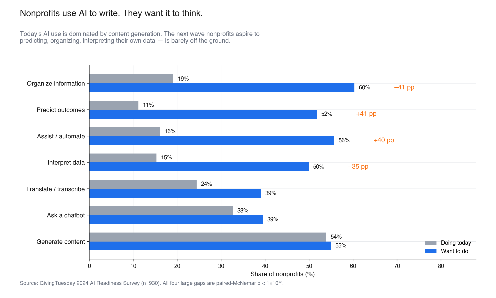
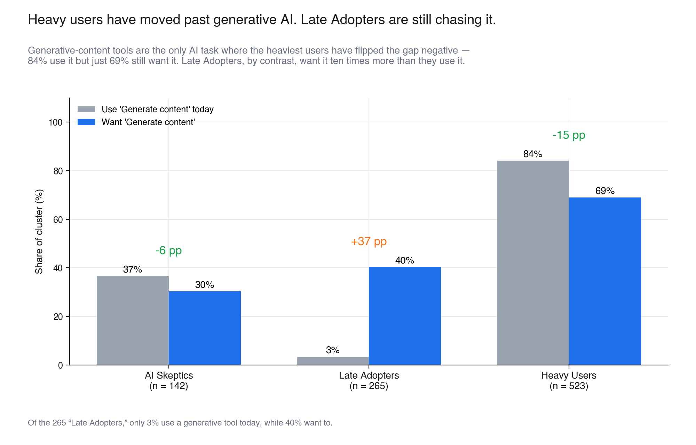
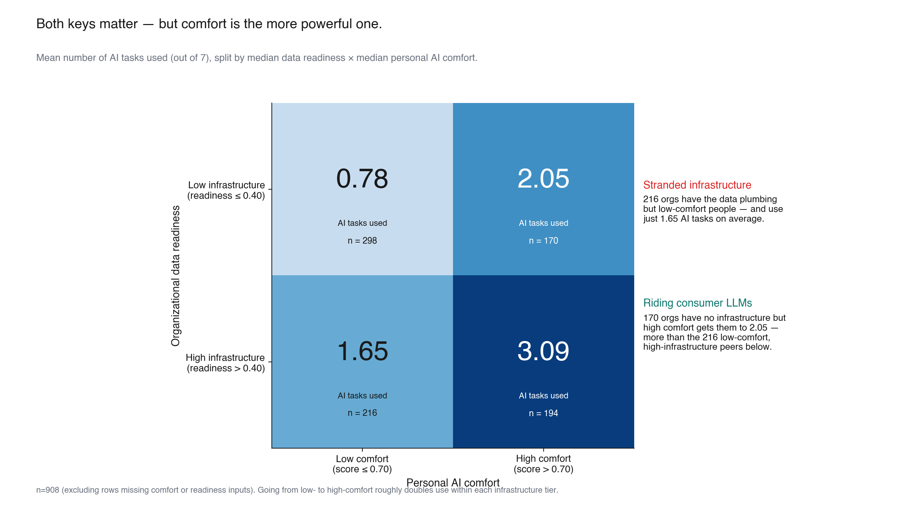
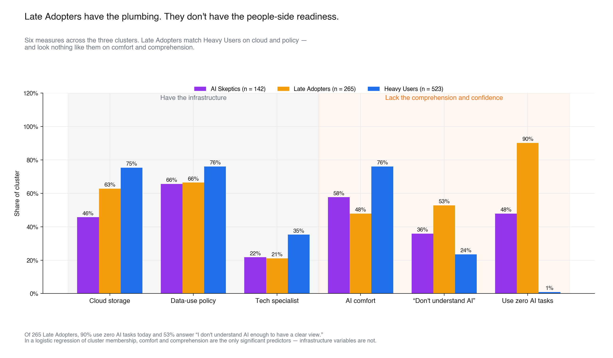
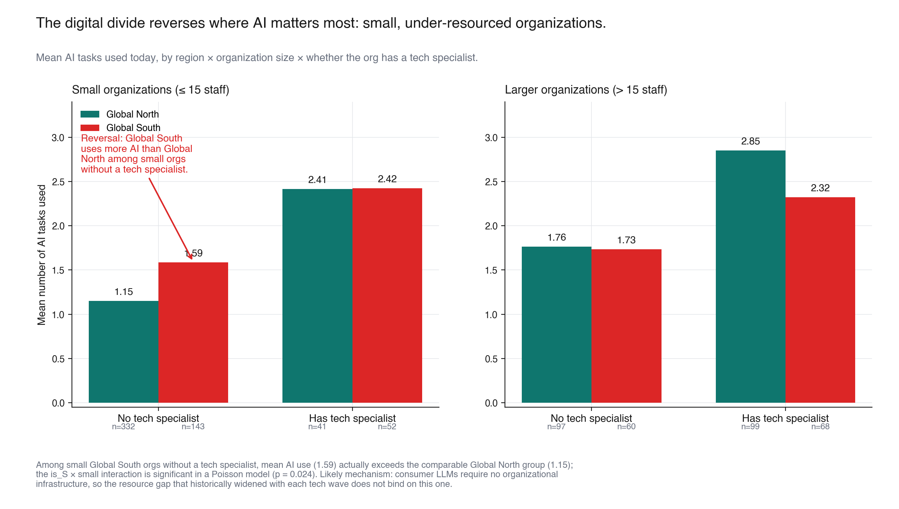
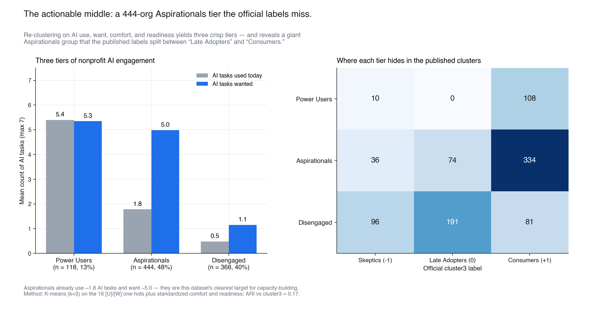

# What nonprofits actually want from AI

*A data-driven narrative from the GivingTuesday 2024 AI Readiness Survey (n = 930).*
*OPDatathon 2026.*

---

## Headline

**Nonprofits already use AI — for writing.** Generative tools have run through the sector: 54% of respondents use them today and so do 84% of the heaviest-using cluster.

**What they want next is something quieter and harder.** They want AI that can *predict* outcomes, *organize* their own information, *interpret* their own data, and *automate* the repetitive work that fills their staff's days. The aspiration gap on those four tasks averages **39 percentage points** — the largest signal in the dataset, and one that survives every reweighting and subgroup test we ran.

**The bottleneck on closing that gap isn't infrastructure, geography, or org size. It's whether their people understand AI.** The cluster the published labels call "Late Adopters" — 28% of the sample — has cloud storage, data-use policies, and tech specialists at rates close to the heaviest users. They use almost no AI today (90% use zero tasks) because **53% answer "I don't understand AI enough to have a clear view."** And in a finding that should reframe global capacity-building strategy: **among small organizations without a tech specialist, Global South nonprofits actually use *more* AI than Global North peers.** The historical digital divide does not bind on this tech wave.

For funders, infrastructure providers, and capacity-building organizations: the action is on comprehension, not plumbing.

---

## Why it matters

Nearly every recent industry report — Stanford HAI, McKinsey, Salesforce, Deloitte — describes the same shape: enterprise AI adoption is racing forward, but value is concentrated in marketing and content. Decision-support and analytics lag. Those reports are written about the *for-profit* economy. The 930 nonprofits in this dataset show the *same* pattern, but with one important difference: the lag isn't because nonprofits don't want analytical AI. They want it more than they want generative AI. They simply do not have the people-side readiness to put it to work.

That changes the policy prescription. The default playbook for nonprofit-tech capacity-building is *infrastructure*: cloud migrations, data warehouses, MERL platforms, governance policies. This dataset says the next dollar of capacity-building is better spent on *comprehension* — workshops, demos, vetted use cases, peer learning — because the orgs most ready to do more already have the plumbing.

---

## Supporting findings

### 1. Heavy users have moved past generative AI; Late Adopters are still chasing it

In the heaviest-using cluster (n = 523), the gap between use and want for "Generate content" goes *negative*: 84% use it, only 69% still want it. That's the only task where users are saturated. In the Late Adopter cluster, by contrast, 40% want generative AI and only 3% have it — the largest single-task gap in any cluster.

*Read this as: the "AI in nonprofits" story you'll see in trend reports has already happened for one in six organizations and hasn't started for the other.*

### 2. Comfort and infrastructure both matter — but comfort matters more, and 216 organizations are stranded

Splitting the sample on the median of personal AI comfort and the median of a data-readiness index (cloud storage, policies, tech and MERL specialists, the five `[D]` data-collection items) yields a clean 2 × 2.

Going from low- to high-comfort roughly **doubles** the number of AI tasks an organization does, within each infrastructure tier. Going from low- to high-infrastructure also roughly doubles use, within each comfort tier. The two effects compound: the high-infrastructure, high-comfort quadrant uses 3.09 AI tasks on average; the low-low quadrant uses 0.78.

The off-diagonal cells are where the action is.

- **216 organizations** are *stranded*: they have the data plumbing but their people aren't ready. They use just 1.65 AI tasks despite owning the infrastructure.
- **170 organizations** are *riding consumer LLMs*: they have no infrastructure but high comfort, and they outperform the stranded group anyway (use = 2.05). Consumer-grade tools (ChatGPT-class) are doing more work than enterprise stacks for these orgs.

In Spearman rank correlations against AI use count, `person_ai_comfort` is the single strongest correlate in the dataset (ρ = +0.50, n = 878), narrowly beating `want_count` (+0.47), `collab_feasibility` (+0.37), and the data-readiness index (+0.34). Org age — `org_years` — has effectively zero correlation (ρ = −0.02).

### 3. The "Late Adopter" paradox: comprehension, not capacity, is the bottleneck

The published HDBSCAN/UMAP clustering distinguishes "AI Skeptics" (n = 142), "Late Adopters" (n = 265), and "Heavy Users" (n = 523). On the two infrastructure measures any tech-capacity report would lead with, **Late Adopters look more like Heavy Users than like Skeptics**: cloud storage 63% vs Skeptics' 46%, data-use policy 66% (matching Skeptics, near Heavy Users' 76%).

Where they diverge is the people-side measures — and the divergence is huge. **53% of Late Adopters answer "I don't understand AI enough to have a clear view"** on the risk/reward scale, vs 36% of Skeptics and 24% of Heavy Users. Personal AI comfort drops from Heavy Users' 0.76 to Late Adopters' 0.48 (lower even than Skeptics, who at 0.58 are more accurately described as *modest, ambivalent users* than as outright opponents).

In a logistic regression of Late-Adopter cluster membership on `cloud_storage`, `tech_person`, `data_use_policy`, `org_size`, `person_ai_comfort`, and a "don't understand" indicator, the only statistically significant predictors are comfort (β = −2.81, p < 10⁻¹⁹) and "don't understand" (β = +0.80, p < 10⁻⁵). The infrastructure variables are all non-significant.

Of those 265 Late Adopters, 90% use zero AI tasks today.

*This is the dataset's most actionable population. They do not need a software stack. They need a workshop.*

### 4. The digital divide reverses where AI matters most

The standard ICT4D narrative — Toyama's "Law of Amplification," Heeks' "adverse digital incorporation," Friederici on Africa's hub effect — predicts that each tech wave widens the gap between Global North and Global South organizations, and most sharply at the small-org tier where capacity is thinnest.

This dataset says the opposite for AI.

In a three-way Poisson interaction of `use_count` on Global-South × small-org × tech-specialist, the **`is_S × small` interaction is positive and significant** (β = +0.34, p = 0.024). Read the cells directly:

| | Small orgs (≤ 15 staff), no tech specialist |
|---|---|
| **Global North (n = 332)** | uses 1.15 AI tasks |
| **Global South (n = 143)** | uses **1.59** AI tasks |

Among small organizations without a tech specialist — the population most disadvantaged on every previous tech wave — Global South orgs *outperform* their Global North counterparts. The gap closes among orgs that *have* a tech specialist (both ~2.4) and even reverses sign among small orgs with one. Africa as a whole (n = 60) uses more AI tasks (1.97) than the GN average (1.63), with West Africa especially active (1.93, n = 15).

The likely mechanism: consumer-grade large language models (ChatGPT, Gemini, Claude) require no organizational infrastructure to use. They are a chat interface, free or cheap, and language-flexible. The asymmetry in expensive enterprise software — the asymmetry that has historically widened with each tech wave — does not bind on this one.

This is consistent with two priors that disagree on the *level* but agree on the *cells*: Nemer's *Technology of the Oppressed* (deficit narrative is wrong at the user level; gaps live in institutional infrastructure) and Avgerou's argument that adoption patterns reflect local rationalities rather than lag on a Global North trajectory.

### 5. The actionable middle: a 444-organization Aspirationals tier that the published clusters hide

Re-clustering the dataset (k-means, k = 3) on the 16 `[U]`/`[W]` task indicators plus standardized comfort and readiness yields three crisp tiers: **Power Users** (n = 118; use 5.4 tasks, want 5.3 — saturation), **Aspirationals** (n = 444; use 1.8, want 5.0 — biggest gap), and **Disengaged** (n = 368; use 0.5, want 1.1).

The Aspirationals tier is **48% of the dataset**, and the published labels split it across two clusters: 334 of them sit in the official "Heavy Users" group (looking confident on the surface but with much more want than use), 74 in "Late Adopters," and 36 even in "AI Skeptics."

If the headline question is *"who should capacity-builders prioritize next?"* — the answer is this group. They already use some AI; they have demonstrated the will. They want roughly three more tasks than they currently do. They are big enough to matter and concentrated enough to act on.

---

## Recommendations

Three concrete moves these findings support:

1. **Reweight capacity-building toward comprehension.** Workshops, vetted use-case libraries, peer learning, and "AI literacy" programs are higher-leverage than another data-warehouse migration for the median nonprofit in this sample. The `person_ai_comfort` variable predicts AI use better than any infrastructure variable; "don't understand AI" predicts non-use better than any resource constraint.
2. **Target the 216 stranded-infrastructure organizations.** They have the plumbing. They are uniquely positioned to leap from current use ≈ 1.65 to the high-low-quadrant level of 3.09 with comprehension support alone — and the analytical AI tasks they want most (predict, organize, interpret) are precisely the ones that *require* the data infrastructure they already have.
3. **Stop pricing the Global South as a deficit market.** This is the first tech wave where small Global South organizations outperform their Global North peers at matched size and capacity. Investments and partnerships that treat that segment as ahead-of-curve adopters — not laggards in need of catch-up — will fit the data better.

---

## Methodology

**Data.** GivingTuesday 2024 AI Readiness Survey, n = 930. Two parallel files: a raw responses parquet (47 columns, mixed types) and a normalized clustering parquet (37 columns, 0–1 rescaled and one-hot expanded). Sample composition: GivingTuesday main list (`gt`, n = 549), India sub-lists (`india`, n = 251), Fundraising.AI / tech-list (`tech`, n = 86), GT regional hubs (`hubs`, n = 44).

**Tests run.** 20 documented findings in `analysis/findings.md`. Headline tests:

- **Aspiration gap (F-1):** paired McNemar per task on `[U]_t` vs `[W]_t`. The four large gaps (Organize, Predict, Assist, Interpret) all clear p < 1×10⁻⁵⁸.
- **Vigilance & risk (F-3):** Poisson regression of consolidated risk count on use count, comfort, risk-reward attitude, and a "don't understand AI" flag. Use sharpens risk awareness (β = +0.080, p < 1e-11); comfort blunts it (β = −0.444, p < 1e-7).
- **Comprehension bottleneck (F-10):** logistic of `(cluster3 == 0)` on infrastructure × comfort × "don't understand." Comfort (β = −2.81) and comprehension (β = +0.80) are the only significant predictors.
- **Mediation (F-11):** causal-step mediation with 1000 bootstrap iterations. Data readiness mediates 18.5% [9–22%] of risk-reward's effect on use count; the readiness coefficient itself implies a 3.2× multiplier on AI tasks per unit of the 0–1 readiness score.
- **Divide reversal (F-8):** three-way Poisson interaction `use_count ~ is_S × small × has_tech`, p = 0.024 on the key term.
- **Re-clustering (F-18):** k-means (k=3) on standardized `[U]`, `[W]`, comfort, readiness; ARI vs the published cluster3 = 0.17 (low — surfaces a different cut).

**Reweighting.** Each headline statistic was re-run with each of the four `ref` source-buckets weighted equally (so `gt` no longer dominates at 59%). The aspiration gap result strengthens under reweighting (Predict gap rises from +40.5pp to +43.9pp; Generate gap reverses sign from +1.1pp to −3.2pp). The comprehension-bottleneck and divide-reversal findings hold.

**Software.** Python 3.12, pandas 2.2, scipy 1.13, scikit-learn 1.5, statsmodels 0.14, matplotlib 3.9. All analysis code in `analysis/`.

---

## Caveats and limits

- **The sample is not random.** It is a convenience sample drawn from GivingTuesday's mailing networks (≈ 59%) plus several India sub-lists (≈ 27%), the Fundraising.AI list (≈ 9%), and GT regional hubs (≈ 5%). Self-selection toward already-engaged organizations is real. The **Global South over-uses AI** finding in particular rests on a sample of nonprofits already plugged into a global generosity movement — they are likely already in the more digitally-connected slice of their local sectors. We have flagged this prominently in the divide-reversal section. The direction of the effect is striking enough to report; the *magnitude* should be treated as an upper bound.
- **All measures are self-report.** AI use, comfort, comprehension, and risk are what respondents report, not what we observe.
- **Single-year snapshot.** No claims about whether these patterns are widening or closing.
- **Multiple comparisons.** Where we ran subgroup sweeps, we adjusted p-values via Benjamini–Hochberg FDR (see `analysis/lib.py::fdr_adjust`). Headline claims clear conventional thresholds even unadjusted.
- **The `ai_risk_reward = -1` code is not a numeric extreme** — it means "I don't understand AI enough to have a clear view." We treat it as a separate category throughout. About one in three respondents are in it.
- **Free-text columns are mixed-language.** The English-language NLP we did on `ai_opentext` (length and a simple keyword sentiment proxy) is sufficient for the engagement-tracks-cluster claim in F-16 but not for any deeper claim. Hindi and other Indian-language responses are real, and a multilingual embedding pass on the full free-text corpus is the most obvious follow-up.

---

## Open questions

If we had more time or another wave of data:

1. **What does "I don't understand AI" mean operationally?** Is it never having seen ChatGPT? Having seen it but not knowing how to apply it to nonprofit work? Or having tried and given up? The intervention is different in each case. A short follow-up survey aimed at the Late Adopter cluster would resolve this.
2. **Is the small-Global-South-orgs lead durable?** This is the most contrarian finding in the report. A second wave in 2025 or 2026 against the same lists would tell us whether AI is genuinely the first equalizing tech wave or whether enterprise capability comes back online and reasserts the historical gap.
3. **What predicts movement into the Power Users tier?** A longitudinal cut would let us identify which of today's Aspirationals successfully cross over — and which capacity supports correlate with crossing.
4. **Multilingual free-text analysis.** With ~600 substantive `ai_opentext` responses, a multilingual sentence-embedding + topic model pass would let us validate the comprehension-bottleneck claim in respondents' own words rather than via a keyword proxy.
